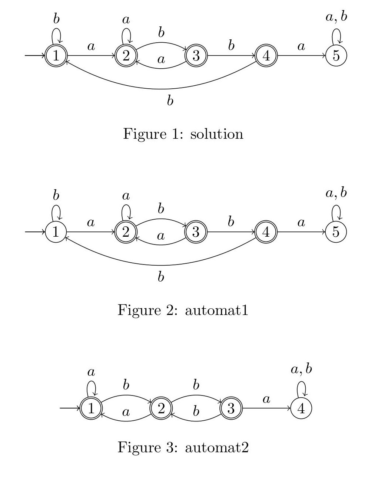
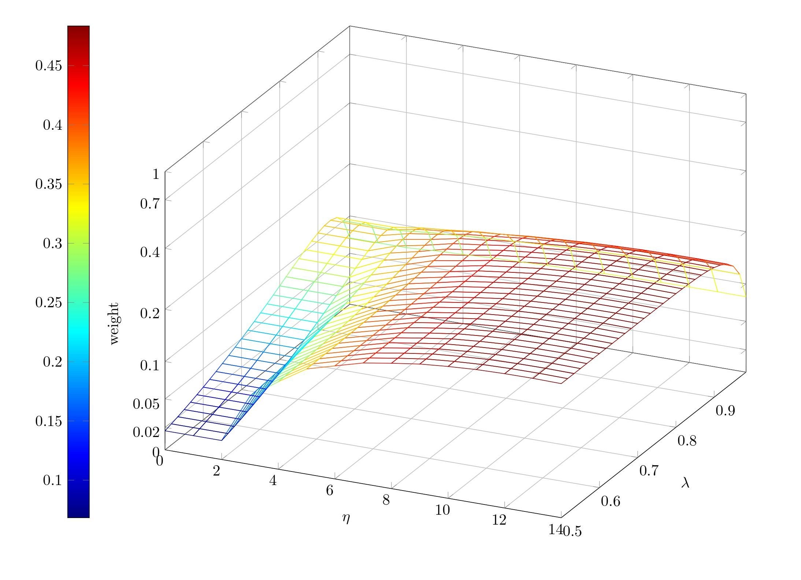

# WoFA
Weight of finite automata (WoFA) is a project to determine the weight of a regular language represented by a finite automaton.
Besides, the weight of a language, a measure of how far 2 regular languages are from each other can be determined by
determining the weight of the symmetric difference.

## Installation

If you want to use this library stand-alone then use the package manager [pip](https://pip.pypa.io/en/stable/) to install the requirements for this package.

```bash
pip install -r requirements.txt 
```

If you want to import this library into another project use:

````bash
pip install git+https://github.com/maurice-herwig/wofa
````
This installs the current master version as a package.

## Usage

To use it, one or two [```FiniteAutomata```](./wofa/FiniteAutomata.py) objects have to be created. The constructor of [```FiniteAutomata(initials, transitions, finals)```](./wofa/FiniteAutomata.py)  needs the set of initial states, the transitions and the set of final states. With [```weight(dfa, eta, lam, variant)```](./wofa/WeightFiniteAutomata.py) the weight of the language of a deterministic finite automaton (DFA) can be determined and with [```weight_diff(fa_a, fa_b, eta, lam, variant)```](./wofa/WeightFiniteAutomata.py) the weight of the difference of two finite automata can be determined.

The parameters' eta, lambda and variant have the following meaning:
- eta: Threshold value up to which all words are constantly included in the weighting.

- lambda: Decay rate, which describes how strongly the weighting decreases for increasing word lengths.

- variant: 'words' | 'wordLengths' Specifies whether all words or all word lengths in the constant part are assigned the same weight.

The following example illustrates the use of this library with a concrete example.

## Example
Here is an example of how the weighting of a language can be used for teaching. The task was to specify a finite automaton which describes the language of the words above the alphabet {a, b} which do not contain the subword "abba". A sample solution for this is given in the following graphic. In addition, two submissions of students are given. Here you can see that automaton 1 is a better submission than the submission of automaton 2, even if both submissions are not submissions that describe the required language. This is expressed by weighting the symmetric difference of the languages of these two automata to the sample solution by a metric value. Which significantly simplifies the evaluation of these deliveries.



```python   
from wofa import FiniteAutomata
from wofa import weight_diff, weight

# Setting the alphabet.
FiniteAutomata.set_alphabet({'a', 'b'})

# Create a solution object.
sol = FiniteAutomata({1}, [(1, 'a', 2), (1, 'b', 1), (2, 'a', 2), (2, 'b', 3), (3, 'a', 2), (3, 'b', 4), (4, 'b', 1)], {1, 2, 3, 4})

# Determine the parameters. x is the proportion of the weight to be allocated to the constant part.
x = 0.5
eta = sol.get_length_longest_run() + 1
lam = (1-x)**(1/eta)

# Loading of different finite automata over the same alphabet.
automaton1 = FiniteAutomata({1}, [(1, 'a', 2), (1, 'b', 1), (2, 'a', 2), (2, 'b', 3), (3, 'a', 2), (3, 'b', 4), (4, 'b', 4), (4, 'b', 2)], {2, 3, 4}))
automaton2 = FiniteAutomata({1}, [(1, 'a', 1), (1, 'b', 2), (2, 'a', 1), (2, 'b', 3),              (3, 'b', 2)                          ], {1, 2, 3}))

# Determine the weight of the symmetrical difference and then print the result.
print(f'Weight diff. Automaton 1 to Solution = {weight_diff(sol, automaton1, eta, lam, "words")[2]}')
print(f'Weight diff. Automaton 2 to Solution = {weight_diff(sol, automaton2, eta, lam, "words")[2]}')

```

Console Output:
```
Weight diff. Automaton 1 to Solution = 0.05534231111710203
Weight diff. Automaton 2 to Solution = 0.145111985762509
```
In the previous example we used default values for the two parameters eta and lambda. Therefore, we determine experimentally good parameter values for the symmetric difference between automaton 1 and the sample solution by means of a graph.
```python   
surface_to_tikz(sol.symmetric_difference(automaton2), etas=np.arange(0, 15), num_lams=30, directory="assets", file_name='SurfaceExample', variant='words', log_scale_fac=4, labels=[0, 0.02, 0.05, 0.1, 0.2, 0.4, 0.7, 1]
```
This creates the file [SurfaceExample.tex](./assets/SurfaceExample.tex). Which represents the following tikzpicture.


More examples can be found in the [Example.py](./Example.py) file.

## Project structure
- [assets](./assets)

  Among other things, over 750 submissions of student submissions are deposited here. This data set makes it possible to perform various tests on a large set of machines.

- [docs](./docs)

- [tests](./tests)

- [wofa](./wofa)

  Contains the source code.
  - [FiniteAutomata.py](./wofa/FiniteAutomata.py)

    Finite automata can be used to create FiniteAutomata objects on which various operations such as minimization, determinization, complement formation, determination of the symmetric difference and many more can be performed.

  - [WeightFiniteAutomata.py](./wofa/WeightFiniteAutomata.py)

    This class can be used to calculate the weight of a FiniteAutomata object and the weight of the difference between two FiniteAutomata objects.

  - [Parser.py](./wofa/Parser.py)

    With the help of this parser, the automata stored in the [assets](./assets) can be used as a [FiniteAutomata](./wofa/FiniteAutomata.py) object.


- [Example.py](./Example.py)

  This file contains some examples of computations of the weights of regular languages represented by a finite automaton. Thus, the file should help to get an understanding of the application of weighting and to clarify the usage with some examples.

## Authors

Research group "[Theoretical Computer Science / Formal Methods](https://www.uni-kassel.de/eecs/fmv/ueber-uns)" of the University of Kassel.

- [Martin Lange](https://www.uni-kassel.de/eecs/fmv/team/detailansicht?tx_ukpersons_personfunctiondetail%5BpersonFunction%5D=105&cHash=d4aafd324e09a6f60e57566642936ee3)
- [Florian Bruse](https://www.uni-kassel.de/eecs/fmv/team/detailansicht?tx_ukpersons_personfunctiondetail%5BpersonFunction%5D=107&cHash=13125e24f465be73259db38fd7f9891e)
- [Maurice Herwig](https://www.uni-kassel.de/eecs/fmv/team/detailansicht?tx_ukpersons_personfunctiondetail%5BpersonFunction%5D=497&cHash=1c737081a13775b82036f707dc667f39)


## License
[MIT](https://choosealicense.com/licenses/mit/)

If you use this template then change the license according to your needs.
See [here](https://choosealicense.com/) to choose the correct license.
