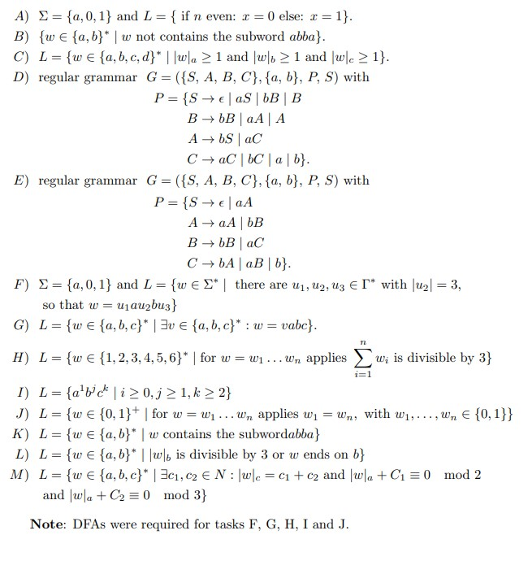

For the following taks, a solution exists in the [solutions](solutions) folder just as various student submissions 
to these assignments exist in the [submissions](submissions) folder. Both can be parsed into a 
[FiniteAutomata](../FiniteAutomata.py) object by the [Parser](../Parser.py).


The following example shows how we can determine the weight for any submission of task A.

```python 
import random
from wofa import FiniteAutomata, get_solution, get_submission, weight_diff

# Setting the alphabet. Important all current examples have the alphabet {a, b}.
FiniteAutomata.set_alphabet({'a', '0', '1'})

# Get autoamats objects
solution = get_solution('A')
submission = get_submission('A', str(random.randint(1, 174)))

# Calc the weight
weight = weight_diff(solution, submission, eta, lam)
```